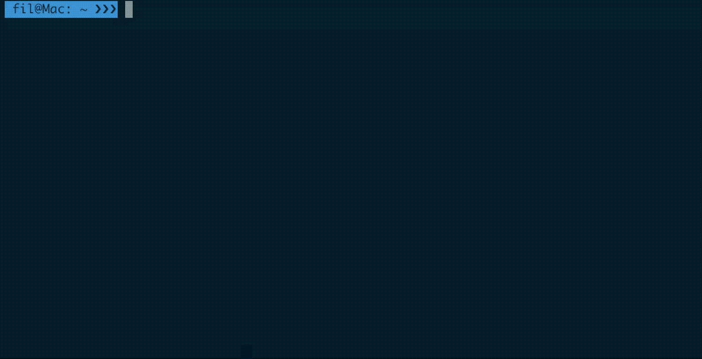

# Bash Powerline

This is a short guide to create a Bash Powerline based on existing online resources.



This Bash Powerline:

- displays the Git status in the command prompt, including information on the active branch and the presence of un-staged files, un-committed files and un-pushed commits;
- displays the active Python Virtual Environment;
- automatically activate a Python Virtual Environment when cd'ing into a path that contains a folder with the same name of the virtual environment.

## Install

Download the following files into your home folder:

- The [official Git Command Prompt script](https://github.com/git/git/blob/master/contrib/completion/git-prompt.sh).

  ```shell
  curl -o $HOME/.git-prompt.sh https://raw.githubusercontent.com/git/git/master/contrib/completion/git-prompt.sh
  ```

- The script to auto-activate a virtual environment — [credits to Harry Marr](https://hmarr.com/2010/jan/19/making-virtualenv-play-nice-with-git/).

  ```shell
  curl -o $HOME/.auto-virtualenv.sh https://raw.githubusercontent.com/FilippoBovo/bash_powerline/master/auto-virtualenv.sh
  ```

- The Virtual Environment Command Prompt script — [adapted from ivanalejandro0 and Daniel Harding's script](https://stackoverflow.com/a/20026992).

  ```shell
  curl -o $HOME/.virtualenv-prompt.sh https://raw.githubusercontent.com/FilippoBovo/bash_powerline/master/virtualenv-prompt.sh
  ```
Add the following lines to your `~/.bashrc` file if you are using Linux or to your `~/.bash_profile` if you are using Mac OS.

```shell
# COMMAND PROMPT: BASH POWERLINE
source $HOME/.git-prompt.sh
export GIT_PS1_SHOWDIRTYSTATE="True"
export GIT_PS1_SHOWUNTRACKEDFILES="True"
export GIT_PS1_SHOWUPSTREAM="auto"

source $HOME/.auto-virtualenv.sh
source $HOME/.virtualenv-prompt.sh
export VIRTUAL_ENV_DISABLE_PROMPT=1

export COL_BASE=$(tput setab 4)$(tput setaf 0)  # Base Colour
export COL_VENV=$(tput setab 3)$(tput setaf 0)  # Virtual Environment Colour
export COL_GIT=$(tput setab 2)$(tput setaf 0)  # Git Colour
export COL_RESET=$(tput sgr0)  # Colour Reset

export PS1='\[$COL_BASE\] \u@\h: \W $(virtualenv_info "\[$COL_VENV\] %s ")$(__git_ps1 "\[$COL_GIT\] %s ")❯❯❯\[$COL_RESET\] '
```

Finally, restart the terminal.

### Colours

The colour configuration used in the above script leads to the colours in the Gif above if coupled with the [Solarized Dark](https://github.com/mbadolato/iTerm2-Color-Schemes#builtin-solarized-dark) colour theme for [iTerm2](https://www.iterm2.com/).

If you are using another theme, you can look for a colour configuraton that matches your theme by changing the number after `tput setab` in the script above according to [this guide](https://linux.101hacks.com/ps1-examples/prompt-color-using-tput/).

## Uninstall

To uninstall this Bash Powerline, simply remove the script snippet added to the `~/.bashrc` or `~/.bash_profile` files during the installation, and remove the downloaded files.

```shell
rm $HOME/.git-prompt.sh $HOME/.auto-virtualenv.sh $HOME/.virtualenv-prompt.sh
```

Finally, restart the terminal.